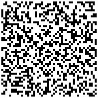
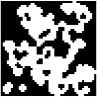

## Introduction
Данный проект знакомит нас с лабиринтами и пещерами, а также основными алгоритмами их обработки, такими как: генерация, отрисовка, поиск решения.

## Information

Лабиринт с "тонкими стенками" представляет собой таблицу размером _n_ строк на _m_ столбцов. 
Между ячейками таблицы могут находиться "стены". Также "стенами" окружена вся таблица в целом. 

Решением лабиринта считается кратчайший путь от заданной начальной точки (ячейки таблицы) до конечной. 
При прохождении лабиринта можно передвигаться к соседним ячейкам, не отделенным "стеной" от текущей ячейки и находящимся сверху, снизу, справа или слева. 
Кратчайшим маршрут считается, если он проходит через наименьшее число ячеек.


## Описание лабиринта

Лабиринт может храниться в файле в виде количества строк и столбцов, а также двух матриц, содержащих положение вертикальных и горизонтальных стен соответственно. 
В первой матрице отображается наличие стены справа от каждой ячейки, а во второй - снизу. 

Пример подобного файла:  
```
4 4
0 0 0 1
1 0 1 1
0 1 0 1
0 0 0 1

1 0 1 0
0 0 1 0
1 1 0 1
1 1 1 1
```

Лабиринт, описанный в этом файле: \


## Генерация с использованием клеточного автомата

Во многих играх есть необходимость в ветвящихся локациях, например пещерах. 
Такие локации могут быть созданы генерацией с использованием клеточного автомата. 
При подобной генерации используется идея, схожая с игрой "Жизнь". 
Суть предложенного алгоритма состоит в реализации всего двух шагов: 
сначала все поле заполняется случайным образом стенами — т.е. для каждой клетки случайным образом определяется, 
будет ли она свободной или непроходимой — а затем несколько раз происходит обновление состояния карты в соответствии с условиями, 
похожими на условия рождения/смерти в «Жизни».

Правила проще, чем в "Жизни" - есть две специальные переменные, одна для "рождения" "мертвых" клеток (предел "рождения") и одна для уничтожения "живых" клеток (предел "смерти"). 
Если "живые" клетки окружены "живыми" клетками, количество которых меньше, чем предел "смерти", они "умирают". 
Аналогично если "мертвые" клетки находятся рядом с "живыми", количество которых больше, чем предел "рождения", они становятся "живыми".

Пример результата работы алгоритма на первой картинке только инициализированный лабиринт, а на второй лабиринт, в котором при последующих шагах больше не происходит изменений: \



## Описание пещер

Пещера, прошедшая 0 шагов симуляции (только инициализированная), может храниться в файле в виде количества строк и столбцов, 
а также матрицы, содержащей положение "живых" и "мертвых" клеток.

Пример подобного файла:
```
4 4
0 1 0 1
1 0 0 1
0 1 0 0
0 0 1 1
```

Пещера, описанная в этом файле: \


## Реализация проекта Maze

программа Maze, позволяющая генерировать и отрисовывать идеальные лабиринты и пещеры:

- Программа разработана на языке C++ стандарта C++17
- При написании кода необходимо придерживаться Google Style
- Сборка программы настроена с помощью Makefile
- Реализован графический пользовательский интерфейс на базе GUI-библиотеки Qt
- Максимальный размер лабиринта - 50х50